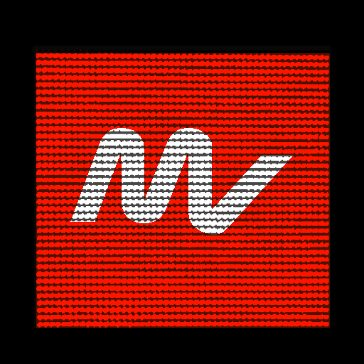

# DigiFlag for F1MV

> Adding a DigiFlag functionality to MultiViewer For F1

# 🚩 Requirements

-   [An Active Subscription to F1TV](https://f1tv.formula1.com/)
-   [MultiViewer for F1 Beta Software](https://beta.f1mv.com/)

# 🏎️ Install

1. Click on the Release Badge below to download the latest release of DigiFlag for your corresponding Operating System (Windows/Mac/Linux).

    

2. (Windows/Linux) Extract the downloaded archive.

    2a. (Mac) Open DMG File & Install Like Any Other App.

# 🏁 Usage

1. Open Multiviewer for F1.
2. Select a Practice/Qualifying/Race Session.
3. Open the Live/Replay Live Timing Window.
4. Open DigiFlag for F1.
5. Click on the Connect to F1MV Button.
6. Select Your Theme.
7. Select Any Other Preferences.
8. Click on the Start DigiFlag Button.

Feel Free to Zoom-In & Zoom-Out and Resize Window to your personal preferance.

# 🧰 Troubleshooting

<!-- TODO -->

# 🤝 Contributing

Contributions, issues and feature requests are welcome!

Feel free to check [issues page](https://github.com/LapsTimeOFF/DigiFlag_F1MV/issues). You can also take a look at the [contributing guide](CONTRIBUTING).

# 📜 License

Copyright © 2022 - Present, DigiFlag Team ([@LapsTimeOFF](https://github.com/LapsTimeOFF), [@TheBaconCat](https://github.com/TheBaconCat), [@JJwatMyself](https://github.com/JJWatMyself), [@f1multiviewer](https://beta.f1mv.com/)).

Distributed under the MIT License. See [LICENSE](./LICENSE). for more information.

# 📝 Credits

Thanks to :  - @JJWatMySelf (for the idea on the discord of F1MV and for some gifs)  - @TheBaconCat (for his contributions on discord of F1MV and for updating some code & gifs)  - @f1multiviewer (for creating the F1MV software)

# ⚖️ Legal

DigiFlag for F1MV is unofficial and unaffiliated with the Formula One organizations. Formula One Licensing B. V. owns the trademarks for F1 ™, FORMULA ONE ™, FORMULA 1 ™,
FIA FORMULA ONE WORLD CHAMPIONSHIP ™, GRAND PRIX ™, and other related marks. This is a non-commercial, fan-made application. Data is used for non-commercial, fair use purposes.

All product and company names are registered® or trademarks™ of their respective
owners. Their use implies no affiliation with or endorsement by them.

All product names, logos, brands, and other trademarks or images used or referred to in
the App are the property of their respective trademark owners. DigiFlag for F1MV has no
affiliation with the trademark owners. They are in no way affiliated, endorsed, connected
to, or sponsored by this App.

"Formula 1®", "F1®", "Alfa Romeo®",
"AlphaTauri®", "Alpine®", "Aston Martin®",
"Ferrari®", "Haas®", "Haas F1 Team®",
"McLaren®", "Mercedes®", "Red Bull®", "Red
Bull Racing®", and "Williams®" are all registered trademarks™
of their respective companies and are not associated with, endorsed by, connected to, or
sponsored by this App in any way.
